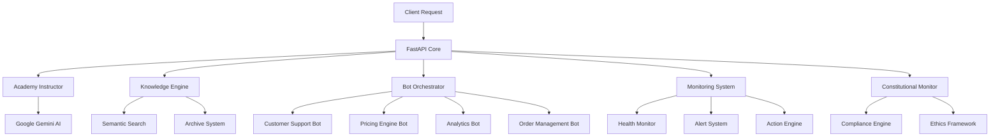

# 🚀 Surooh Academy - Advanced AI-Powered Bot Factory

<div align="center">

[](https://python.org)
[](https://fastapi.tiangolo.com)
[](LICENSE)
[](https://ai.google.dev)
[]()

*نظام ذكاء اصطناعي متكامل لتوليد وتدريب البوتات الذكية*

[العربية](#arabic-docs) | [English](#english-docs) | [Docs](./docs/) | [API](./docs/api.md) | [Demo](#demo)

</div>

---

## 🌟 Overview

**Surooh Academy** is a cutting-edge AI system that revolutionizes bot creation and training. It analyzes any project requirements and generates comprehensive bot deployment plans within seconds, then creates detailed training programs for each bot using **Google Gemini AI**.

### ✨ Key Features

- 🤖 **Multi-Agent Bot Factory**: Automatically generate specialized bots for any business need
- 🧠 **AI-Powered Analysis**: Deep project analysis using Google Gemini AI
- 📚 **Knowledge-Aware Training**: Train bots using your real company data (111+ file types supported)
- 🔄 **Smart Orchestration**: Coordinate multiple bots for complex tasks
- 📊 **Real-time Monitoring**: Proactive system health monitoring and alerting
- 🌐 **Multi-modal Support**: Text, audio, video, and image processing
- 🏛️ **Constitutional Compliance**: Built-in governance and ethics framework
- 🔍 **Advanced Search**: Semantic search with RAG capabilities

### 🎯 Supported Bot Types

| Bot Type | Purpose | Capabilities |
|----------|---------|--------------|
| 🛎️ **Customer Support** | Handle customer inquiries | Order tracking, FAQ, ticket creation |
| 💰 **Pricing Engine** | Dynamic pricing optimization | Market analysis, competitor tracking |
| 📊 **Analytics Reporter** | Generate business insights | Data analysis, automated reporting |
| 📦 **Order Orchestrator** | Manage order lifecycle | Inventory, shipping, fulfillment |
| 🔧 **Technical Support** | Handle technical issues | Troubleshooting, documentation |
| 🏢 **Business Intelligence** | Strategic decision support | Market trends, forecasting |
| 📱 **Integration Hub** | Connect external services | APIs, webhooks, automation |
| 🎯 **Marketing Automation** | Campaign management | Lead generation, personalization |

---

## 🚀 Quick Start

### Prerequisites

- **Python 3.11+**
- **Google Cloud Project** with Vertex AI API enabled
- **Service Account** with appropriate permissions

### 1️⃣ Installation

```bash
# Clone the repository
git clone https://github.com/sorooh/surooh-academy.git
cd surooh-academy

# Install dependencies
pip install -r requirements.txt

# Copy environment template
cp .env.example .env
```

### 2️⃣ Configuration

Edit `.env` file:

```env
GCP_PROJECT=your-gcp-project-id
GCP_LOCATION=europe-west4
GOOGLE_APPLICATION_CREDENTIALS=./service-account.json
OPENAI_API_KEY=your-openai-api-key
```

### 3️⃣ Launch

```bash
# Start the server
uvicorn main:app --host 0.0.0.0 --port 5000 --reload

# Or using Docker
docker-compose up
```

### 4️⃣ Test Drive

```bash
# Health check
curl http://localhost:5000/health

# Analyze a project
curl -X POST http://localhost:5000/academy/intake \
  -H "Content-Type: application/json" \
  -d '{
    "description": "نريد بناء متجر إلكتروني في هولندا يحتاج دعم عملاء ذكي ومحرك تسعير ديناميكي",
    "project_name": "Dutch E-Commerce Store",
    "tenant": "ecommerce-nl"
  }'
```

---

## 📡 API Documentation

### Core Endpoints

#### 🎯 Project Analysis
```http
POST /academy/intake
```
Analyze project requirements and generate bot deployment plan.

#### 🎓 Bot Training
```http
POST /academy/train
POST /academy/train/pricing
POST /academy/train/analytics
POST /academy/train/orders
```
Train specialized bots with custom configurations.

#### 🧠 Advanced Training
```http
POST /academy/train/knowledge
```
Knowledge-aware training using company archives.

#### 🔍 Semantic Search
```http
POST /core/semantic_search
```
Advanced search across knowledge base.

#### 🎭 Multi-Agent Orchestration
```http
POST /academy/orchestrate
```
Coordinate multiple bots for complex tasks.

[📖 **Full API Documentation**](./docs/api.md)

---

## 🏗️ Architecture



### 🔧 System Components

- **🧠 Academy Instructor**: Core AI engine powered by Google Gemini
- **📚 Knowledge Engine**: Advanced RAG system with semantic search
- **🎭 Bot Orchestrator**: Multi-agent coordination system
- **🔍 Monitoring Daemon**: Proactive system health monitoring
- **🏛️ Constitutional Monitor**: Governance and compliance framework
- **🌐 Integration Hub**: External service connectors

---

## 🚢 Deployment

### Docker Deployment

```bash
# Build and run
docker-compose up -d

# Scale services
docker-compose up -d --scale academy=3

# Monitor logs
docker-compose logs -f
```

### Production Deployment

```bash
# Using Gunicorn
gunicorn main:app -w 4 -k uvicorn.workers.UvicornWorker --bind 0.0.0.0:5000

# With SSL
gunicorn main:app -w 4 -k uvicorn.workers.UvicornWorker \
  --bind 0.0.0.0:443 --keyfile=key.pem --certfile=cert.pem
```

### Cloud Deployment

- **Google Cloud Run**: Ready-to-deploy configurations
- **AWS ECS**: Container orchestration setup
- **Azure Container Apps**: Serverless deployment options
- **Kubernetes**: Helm charts included

---

## 📊 Monitoring & Analytics

### Real-time Metrics

- 🔥 **System Health**: CPU, Memory, Disk usage
- 📈 **API Performance**: Response times, error rates
- 🤖 **Bot Activity**: Training sessions, orchestration events
- 📚 **Knowledge Base**: Search queries, document processing
- 🏛️ **Compliance**: Constitutional violations, trust scores

### Alerting

- 🚨 **Critical Alerts**: System failures, security breaches
- ⚠️ **Warning Alerts**: Performance degradation, resource limits
- 💡 **Smart Actions**: Automated remediation suggestions

---

## 🛡️ Security & Compliance

### Security Features

- 🔐 **API Authentication**: JWT tokens, API keys
- 🔒 **Data Encryption**: At-rest and in-transit encryption
- 🛡️ **Input Validation**: XSS, injection prevention
- 📝 **Audit Logging**: Comprehensive activity tracking
- 🔍 **PII Redaction**: Automatic sensitive data protection

### Constitutional Framework

Surooh Academy includes a built-in constitutional compliance system:

- **📜 Constitution Document**: Defines ethical guidelines
- **⚖️ Compliance Monitoring**: Real-time violation detection
- **🎯 Trust Scoring**: Bot reliability assessment
- **🚫 Blacklist Management**: Automatic bot suspension

---

## 🧪 Testing

```bash
# Run all tests
pytest

# Test with coverage
pytest --cov=server --cov-report=html

# Load testing
locust -f tests/load_test.py --host=http://localhost:5000

# Integration tests
python -m pytest tests/integration/
```

---

## 🤝 Contributing

We welcome contributions! Please see our [Contributing Guidelines](./CONTRIBUTING.md).

### Development Setup

```bash
# Install development dependencies
pip install -r requirements-dev.txt

# Install pre-commit hooks
pre-commit install

# Run linting
black . && isort . && flake8

# Run type checking
mypy server/
```

### Code Standards

- **Code Style**: Black formatter, isort imports
- **Type Hints**: Full type annotation required
- **Documentation**: Docstrings for all public functions
- **Testing**: Minimum 80% test coverage

---

## 📚 Documentation

- 📖 [**API Reference**](./docs/api.md)
- 🏗️ [**Architecture Guide**](./docs/architecture.md)
- 🚀 [**Deployment Guide**](./docs/deployment.md)
- 🔧 [**Configuration**](./docs/configuration.md)
- 🧪 [**Testing Guide**](./docs/testing.md)
- 🤝 [**Contributing**](./CONTRIBUTING.md)

---

## 📈 Roadmap

### 🎯 Current Phase (v2.5)
- ✅ Multi-agent orchestration
- ✅ Knowledge-aware training
- ✅ Constitutional compliance
- ✅ Advanced monitoring

### 🚀 Next Phase (v3.0)
- 🔄 **Real-time Learning**: Continuous bot improvement
- 🌍 **Multi-language Support**: Global deployment ready
- 🔗 **Advanced Integrations**: CRM, ERP, and more
- 🎨 **Visual Bot Builder**: Drag-and-drop interface

### 🌟 Future Vision (v4.0)
- 🧠 **AGI Integration**: Next-generation AI capabilities
- 🤖 **Self-evolving Bots**: Autonomous improvement
- 🌐 **Federated Learning**: Cross-organization knowledge sharing
- 🎯 **Predictive Analytics**: Anticipate business needs

---

## 📞 Support

- 📧 **Email**: support@surooh-academy.com
- 📱 **Discord**: [Join our community](https://discord.gg/surooh)
- 📖 **Documentation**: [docs.surooh-academy.com](https://docs.surooh-academy.com)
- 🐛 **Issues**: [GitHub Issues](https://github.com/sorooh/surooh-academy/issues)

---

## 📝 License

This project is proprietary software. See [LICENSE](./LICENSE) for details.

**Surooh Academy © 2025 - Empowering the future of intelligent automation**

---

<div id="arabic-docs"></div>

## 🇸🇦 الوثائق العربية

### 📋 نظرة عامة

**أكاديمية سُروح** هو نظام ذكاء اصطناعي متطور يُحدث ثورة في إنشاء وتدريب البوتات. يحلل متطلبات أي مشروع ويولد خطط نشر شاملة للبوتات خلال ثوانٍ، ثم ينشئ برامج تدريب مفصلة لكل بوت باستخدام **Google Gemini AI**.

### 🎯 الميزات الرئيسية

- 🤖 **مصنع البوتات المتعدد**: إنشاء بوتات متخصصة تلقائياً لأي احتياج تجاري
- 🧠 **تحليل مدعوم بالذكاء الاصطناعي**: تحليل عميق للمشاريع باستخدام Google Gemini AI
- 📚 **تدريب مدرك للمعرفة**: تدريب البوتات باستخدام بيانات شركتك الحقيقية (دعم أكثر من 111 نوع ملف)
- 🔄 **تنسيق ذكي**: تنسيق بوتات متعددة للمهام المعقدة
- 📊 **مراقبة فورية**: مراقبة استباقية لصحة النظام والتنبيهات
- 🌐 **دعم متعدد الوسائط**: معالجة النصوص والصوت والفيديو والصور
- 🏛️ **امتثال دستوري**: إطار حوكمة وأخلاقيات مدمج
- 🔍 **بحث متقدم**: بحث دلالي مع قدرات RAG

### 🚀 البدء السريع

```bash
# استنساخ المستودع
git clone https://github.com/sorooh/surooh-academy.git
cd surooh-academy

# تثبيت التبعيات
pip install -r requirements.txt

# تشغيل الخادم
uvicorn main:app --host 0.0.0.0 --port 5000 --reload
```

### 📡 نقاط النهاية الرئيسية

- `POST /academy/intake` - تحليل متطلبات المشروع
- `POST /academy/train` - تدريب البوتات المتخصصة
- `POST /academy/orchestrate` - تنسيق البوتات المتعددة
- `POST /core/semantic_search` - البحث الدلالي المتقدم

[📖 **الوثائق الكاملة باللغة العربية**](./docs/ar/)

---

<div align="center">

**🌟 "يُمكّن مستقبل الأتمتة الذكية" 🌟**

Made with ❤️ by the Surooh Academy Team

</div>